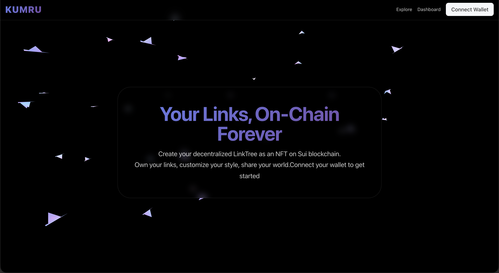
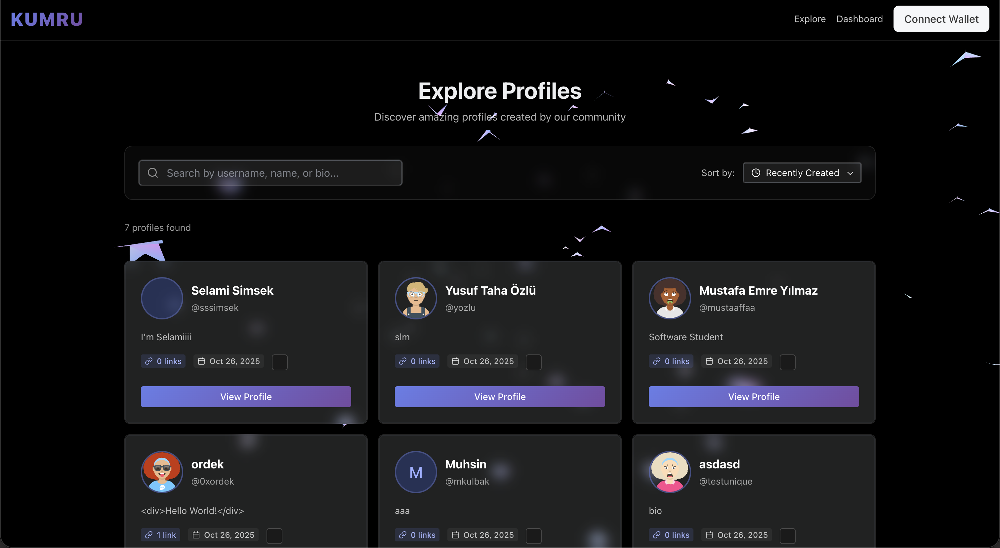

# Kumru - On-Chain LinkTree on Sui & Walrus

<div align="center">

**A fully decentralized LinkTree alternative built on Sui blockchain and hosted on Walrus Sites**

[](https://sui.io)
[](https://walrus.xyz)
[](https://suins.io)
[](LICENSE)

[Live Demo](https://kurmu.trwal.app)

</div>

---

## 📖 Table of Contents

- [Overview](#-overview)
- [What is Kumru?](#-what-is-kumru)
- [Features](#-features)
- [Architecture](#-architecture)
- [Tech Stack](#-tech-stack)
- [Getting Started](#-getting-started)
- [Project Structure](#-project-structure)
- [Smart Contract](#-smart-contract)
- [Deployment](#-deployment)
- [Usage](#-usage)
- [Future Roadmap](#-future-roadmap)
- [Contributing](#-contributing)
- [License](#-license)

---

## 🌟 Overview

**Kumru** is a decentralized alternative to Linktree, built entirely on blockchain technology. Unlike traditional link-in-bio services that rely on centralized servers, Kumru leverages:

- **Sui Blockchain** - Profile data stored as on-chain NFT objects
- **Walrus Sites** - Decentralized hosting for the frontend application
- **SuiNS** - Human-readable domain names (`.sui` addresses)

Your profile is truly yours - it's an NFT that you own, transfer, or delete at any time. No centralized platform can censor, modify, or take down your content.

---

## 🎯 What is Kumru?

Kumru enables users to:

1. **Create a decentralized profile** as an NFT on the Sui blockchain
2. **Add and manage links** - All stored on-chain with full ownership
3. **Customize themes** - Choose colors, button styles, and fonts
4. **Share social media** - Display your Twitter, Discord, GitHub, etc.
5. **Access via SuiNS** - Get a memorable `.sui` domain name
6. **Host on Walrus** - Completely decentralized frontend hosting

Think of it as LinkTree meets Web3 - where you truly own your digital identity.

---

## 📸 Screenshots

### Home Page


### Explore Profiles


---

## ✨ Features

### Core Features

- ✅ **Wallet Integration** - Connect with Sui wallets (Sui Wallet, Ethos, etc.)
- ✅ **Profile as NFT** - Your profile is a transferable, ownable NFT
- ✅ **Link Management** - Add, edit, delete, and reorder links with drag-and-drop
- ✅ **Username Registry** - Unique usernames stored on-chain
- ✅ **Theme Customization** - Personalize colors, button styles, and fonts
- ✅ **Social Media Links** - Display Twitter, Discord, Telegram, GitHub, Website
- ✅ **Public Profile Pages** - Share your profile via clean URLs
- ✅ **Link Analytics** - Track link visibility and engagement (coming soon)
- ✅ **Profile Transfer** - Transfer your profile NFT to another wallet
- ✅ **Profile Deletion** - Permanently delete your profile and reclaim storage

### Technical Features

- 🔗 **Walrus Sites Hosting** - Decentralized frontend hosting
- 🌐 **SuiNS Integration** - Human-readable `.sui` domain names
- 📱 **Responsive Design** - Works perfectly on mobile and desktop
- 🎨 **Modern UI** - Built with Radix UI and Tailwind CSS
- ⚡ **Fast Performance** - Optimized with Vite and React
- 🔐 **Secure** - All data on-chain, no centralized database

---

## 🏗️ Architecture

```
┌─────────────────────────────────────────────────────────────┐
│                         User Interface                      │
│              (React + Vite + Mysten dApp Kit)               │
└────────────────┬────────────────────────────────────────────┘
                 │
                 │ Walrus Sites (Decentralized Hosting)
                 │
┌────────────────▼────────────────────────────────────────────┐
│                    Sui Blockchain Layer                     │
│  ┌──────────────────────────────────────────────────────┐   │
│  │         Profile Smart Contract (Move)                │   │
│  │  • Profile NFTs                                      │   │
│  │  • Link Management                                   │   │
│  │  • Username Registry                                 │   │
│  │  • Theme Configuration                               │   │
│  └──────────────────────────────────────────────────────┘   │
│                                                             │
│  ┌──────────────────────────────────────────────────────┐   │
│  │              SuiNS Integration                       │   │
│  │  • .sui domain resolution                            │   │
│  │  • Profile linking                                   │   │
│  └──────────────────────────────────────────────────────┘   │
└─────────────────────────────────────────────────────────────┘
```

### Data Flow

1. **User connects wallet** → dApp Kit authenticates
2. **Create/Update profile** → Transaction sent to Sui blockchain
3. **Profile stored as NFT** → Object stored on-chain with unique ID
4. **Username registered** → Added to shared UsernameRegistry
5. **Frontend hosted** → Walrus Sites serves the React application
6. **SuiNS resolution** → `.sui` name points to your profile

---

## 🛠️ Tech Stack

### Blockchain Layer
- **Sui Blockchain** - Fast, low-cost L1 blockchain
- **Move Language** - Smart contract development
- **Sui SDK** - TypeScript client for blockchain interaction

### Frontend Layer
- **React 18** - UI framework
- **TypeScript** - Type-safe development
- **Vite** - Lightning-fast build tool
- **Radix UI** - Accessible component primitives
- **Tailwind CSS** - Utility-first styling
- **dApp Kit** - Sui wallet integration
- **React Router** - Client-side routing
- **React Query** - Data fetching and caching
- **DND Kit** - Drag-and-drop functionality

### Hosting & Infrastructure
- **Walrus Sites** - Decentralized frontend hosting
- **SuiNS** - Domain name resolution
- **TRWal Portal** - Testnet Walrus portal access

---

## 🚀 Getting Started

### Prerequisites

Before you begin, ensure you have the following installed:

- **Node.js** (v18 or higher) - [Download](https://nodejs.org/)
- **pnpm** (v8 or higher) - `npm install -g pnpm`
- **Sui CLI** - [Installation Guide](https://docs.sui.io/guides/developer/getting-started/sui-install)
- **Walrus CLI** - [Installation Guide](https://docs.wal.app/usage/setup.html)
- **Walrus Site Builder** - [Installation Guide](https://docs.wal.app/walrus-sites/tutorial-install.html)

### Installation

1. **Clone the repository**
   ```bash
   git clone https://github.com/meke-ops/kumru-chain.git
   cd kumru-chain/kumru-front
   ```

2. **Install dependencies**
   ```bash
   cd kumru-chain
   pnpm install
   ```

3. **Configure environment variables**
   ```bash
   cp .env.example .env
   ```
   
   Edit `.env` and add your configuration:
   ```env
   VITE_PACKAGE_ID=your_package_id
   VITE_REGISTRY_ID=your_registry_id
   VITE_NETWORK=testnet
   ```

4. **Start the development server**
   ```bash
   pnpm dev
   ```

   The app will be available at `http://localhost:5173`

### Setting Up Sui Wallet

1. Install [Sui Wallet Extension](https://chrome.google.com/webstore/detail/sui-wallet)
2. Create a new wallet or import existing one
3. Switch to **Testnet** network
4. Get testnet SUI tokens from [Sui Testnet Faucet](https://discord.gg/sui)

---

## 📁 Project Structure

```
kumru-chain/
├── src/
│   ├── components/          # Reusable UI components
│   │   ├── LinkCard.tsx           # Individual link display
│   │   ├── ProfileCard.tsx        # Profile preview card
│   │   ├── LinkDialog.tsx         # Add/Edit link modal
│   │   ├── ThemeSelector.tsx      # Theme customization
│   │   ├── SortableLinkList.tsx   # Drag-and-drop links
│   │   └── settings/              # Settings components
│   │       ├── GeneralSettings.tsx
│   │       ├── SocialSettings.tsx
│   │       ├── ThemeSettings.tsx
│   │       └── AdvancedSettings.tsx
│   ├── pages/               # Page components
│   │   ├── Home.tsx               # Landing page
│   │   ├── Dashboard.tsx          # User dashboard
│   │   ├── CreateProfile.tsx      # Profile creation
│   │   ├── PublicProfile.tsx      # Public profile view
│   │   ├── LinkManager.tsx        # Link management
│   │   ├── Settings.tsx           # Profile settings
│   │   └── Explore.tsx            # Discover profiles
│   ├── utils/               # Utility functions
│   │   └── sui.ts                 # Sui blockchain helpers
│   ├── types/               # TypeScript types
│   │   └── profile.ts             # Profile interfaces
│   ├── config/              # Configuration
│   │   └── constants.ts           # App constants
│   ├── App.tsx              # Main app component
│   ├── main.tsx             # Entry point
│   └── networkConfig.ts     # Sui network config
├── move/                    # Smart contracts
│   └── counter/
│       ├── sources/
│       │   └── profile.move       # Profile contract
│       ├── Move.toml              # Move configuration
│       └── build/                 # Compiled contracts
├── ws-resources.json        # Walrus Sites config
├── package.json
├── vite.config.mts
└── tsconfig.json
```

---

## 📜 Smart Contract

The Kumru smart contract is written in **Move** and deployed on Sui blockchain.

### Key Modules

#### Profile Module (`linktree::profile`)

**Main Structs:**
- `Profile` - The main NFT object containing all profile data
- `Link` - Individual link with title, URL, description, icon
- `Theme` - Customization settings (colors, fonts, button styles)
- `SocialLinks` - Social media handles
- `UsernameRegistry` - Shared object tracking unique usernames

**Core Functions:**
- `create_profile()` - Create a new profile NFT
- `update_profile()` - Update display name, bio, avatar
- `add_link()` - Add a new link
- `update_link()` - Edit existing link
- `delete_link()` - Remove a link
- `reorder_links()` - Change link order
- `update_theme()` - Customize appearance
- `update_social_links()` - Set social media links
- `transfer_profile()` - Transfer NFT to another address
- `delete_profile()` - Permanently delete profile

### Smart Contract Deployment

1. **Navigate to Move project**
   ```bash
   cd move/counter
   ```

2. **Build the contract**
   ```bash
   sui move build
   ```

3. **Deploy to testnet**
   ```bash
   sui client publish --gas-budget 100000000
   ```

4. **Save the Package ID and Registry ID**
   - Update `.env` with the deployed addresses

### Testing Smart Contract

```bash
# Run Move tests
sui move test

# Run specific test
sui move test --filter profile_tests
```

---

## 🌐 Deployment

### Deploying to Walrus Sites

1. **Build the production app**
   ```bash
   cd kumru-chain
   pnpm build
   ```

2. **Configure Walrus Sites**
   
   Ensure `ws-resources.json` is configured:
   ```json
   {
     "site_name": "Kumru LinkTree",
     "object_id": "your_deployed_package_id"
   }
   ```

3. **Set up Walrus CLI**
   
   Configure `$HOME/walrus/sites-config.yaml`:
   ```yaml
   contexts:
     testnet:
       portal: trwal.app
       package: 0xf99aee9f21493e1590e7e5a9aea6f343a1f381031a04a732724871fc294be799
       staking_object: 0xbe46180321c30aab2f8b3501e24048377287fa708018a5b7c2792b35fe339ee3
       general:
          wallet_env: testnet
          walrus_context: testnet
          walrus_package: 0xd84704c17fc870b8764832c535aa6b11f21a95cd6f5bb38a9b07d2cf42220c66

   default_context: testnet
   ```

4. **Deploy to Walrus**
   ```bash
   site-builder deploy ./dist --epochs 1
   ```

5. **Access your site**
   - Via B36 ID: `https://<b36-id>.trwal.app/`
   - Via SuiNS: `https://<yourname>.trwal.app/` (after SuiNS setup)

### Setting Up SuiNS

1. **Register a .sui domain**
   - Visit [SuiNS Testnet](https://testnet.suins.io/)
   - Connect your wallet
   - Register your desired name (e.g., `kumru.sui`)

2. **Link to your Walrus Site**
   ```bash
   # Point your .sui name to your Walrus site object
   sui client call --package <SUINS_PACKAGE> \
     --module name \
     --function set_target_address \
     --args <YOUR_NAME_NFT_ID> <WALRUS_SITE_OBJECT_ID>
   ```

3. **Access via SuiNS**
   - Your site will be available at `https://kumru.trwal.app/`

---

## 💡 Usage

### Creating a Profile

1. **Connect Wallet**
   - Click "Connect Wallet" button
   - Select your Sui wallet
   - Approve the connection

2. **Create Profile**
   - Click "Create Profile"
   - Enter username (unique, max 30 characters)
   - Add display name
   - Write bio (max 160 characters)
   - Add avatar URL
   - Click "Create"

3. **Add Links**
   - Go to Dashboard
   - Click "Add Link"
   - Enter title, URL, description (optional)
   - Choose an icon
   - Save

4. **Customize Theme**
   - Navigate to Settings → Theme
   - Select background color
   - Choose button style (rounded, square, pill)
   - Pick font family
   - Save changes

5. **Share Your Profile**
   - Your profile URL: `https://kumru.app/profile/<username>`
   - Or via SuiNS: `https://<username>.trwal.app/`

### Managing Links

- **Reorder**: Drag and drop links to change order
- **Edit**: Click edit icon on any link
- **Delete**: Click trash icon to remove
- **Toggle Visibility**: Show/hide links without deleting

### Profile Management

- **Transfer**: Send your profile NFT to another wallet
- **Update**: Change display name, bio, or avatar anytime
- **Delete**: Permanently remove your profile (irreversible)

---

## 🗺️ Future Roadmap

### Phase 1 (Current)
- [x] Basic profile creation and management
- [x] Link management (add, edit, delete, reorder)
- [x] Theme customization
- [x] Walrus Sites deployment
- [x] SuiNS integration

### Phase 2 (Next)
- [ ] Link analytics (click tracking)
- [ ] Custom domains (beyond SuiNS)
- [ ] Profile templates
- [ ] Link scheduling (publish at specific times)
- [ ] QR code generation
- [ ] SEO optimization

### Phase 3 (Future)
- [ ] zkLogin integration (login with Google, GitHub, etc.)
- [ ] Sponsored transactions (gasless for users)
- [ ] Profile discovery & trending
- [ ] Verified badges
- [ ] Premium themes marketplace
- [ ] Multi-profile support
- [ ] API for developers

### Phase 4 (Advanced)
- [ ] Custom widgets (embed YouTube, Spotify, etc.)
- [ ] Analytics dashboard
- [ ] Team profiles (multi-user)
- [ ] White-label solution for businesses
- [ ] Mobile app (iOS & Android)

See [FUTURE_FEATURES.md](./kumru-chain/FUTURE_FEATURES.md) for detailed roadmap.

---

## 🤝 Contributing

We welcome contributions from the community! Here's how you can help:

### Ways to Contribute

1. **Report Bugs** - Open an issue with detailed reproduction steps
2. **Suggest Features** - Share your ideas in GitHub Discussions
3. **Submit PRs** - Fix bugs or add features
4. **Improve Docs** - Help us improve documentation
5. **Test** - Try the app and provide feedback

### Development Workflow

1. Fork the repository
2. Create a feature branch: `git checkout -b feature/amazing-feature`
3. Make your changes
4. Test thoroughly
5. Commit: `git commit -m 'Add amazing feature'`
6. Push: `git push origin feature/amazing-feature`
7. Open a Pull Request

### Code Style

- Follow TypeScript best practices
- Use ESLint configuration
- Format with Prettier
- Write meaningful commit messages
- Add comments for complex logic

---

## 📚 Resources

### Documentation
- [Sui Documentation](https://docs.sui.io/)
- [Move Book](https://move-book.com/)
- [Walrus Sites Docs](https://docs.wal.app/walrus-sites/)
- [SuiNS Docs](https://docs.suins.io/)
- [Mysten dApp Kit](https://sdk.mystenlabs.com/dapp-kit)

### Tools
- [Sui Explorer (Testnet)](https://suiscan.xyz/testnet)
- [Walrus Explorer](https://walruscan.com/testnet)
- [SuiNS Registry](https://testnet.suins.io/)
- [Sui Testnet Faucet](https://discord.gg/sui)

### Community
- [Sui Discord](https://discord.gg/sui)
- [Sui Twitter](https://twitter.com/SuiNetwork)
- [Walrus Website](https://www.walrus.xyz/)

---

## 📄 License

This project is licensed under the **MIT License** - see the [LICENSE](LICENSE) file for details.

---

## 🙏 Acknowledgments

- **Mysten Labs** - For building Sui and Walrus
- **Sui Foundation** - For supporting the ecosystem
- **SuiNS** - For decentralized naming service
- **Radix UI** - For accessible components
- **Vite Team** - For blazing fast tooling

---

<div align="center">

**Built with ❤️ on Sui & Walrus**

[⬆ Back to Top](#kumru---on-chain-linktree-on-sui--walrus)

</div>
